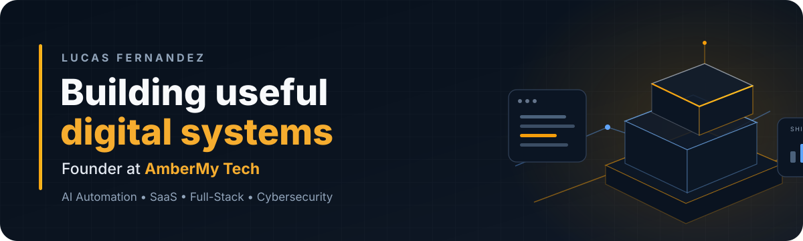

  

## About

I'm **Lucas Fernandez**, founder of **AmberMy Tech**. I design and build software that connects engineering with real business operations — from AI-assisted sales workflows and internal tools to SaaS products, automation infrastructure and security-focused utilities.

I like working across the whole system: **product design, frontend, backend, data, APIs, automation, deployment and iteration**. The goal is simple: ship software that is useful outside the demo.

**Buenos Aires, Argentina** · **English / Spanish** · Open to building, collaborating and solving hard product problems.

---

## Selected work

<table>
<tr>
<td width="50%" valign="top">

### AmberQR
**Privacy-aware QR infrastructure and analytics**

Edge-first redirects, workspace analytics and server-side measurement designed to keep scans fast and data collection intentional.

TypeScript · Cloudflare Workers · KV · PostgreSQL · REST APIs

</td>
<td width="50%" valign="top">

### Business software
**Operational software built around real workflows**

CRM/POS-style systems for inventory, acquisition costs, sales, profitability, reporting, cash flow and day-to-day operations.

React · TypeScript · PostgreSQL · SQLite · Supabase / Neon

</td>
</tr>
<tr>
<td width="50%" valign="top">

### AI sales automation
**AI connected to actual business operations**

WhatsApp lead qualification, conversational context, routing, human handoff and CRM automation instead of isolated chatbot demos.

n8n · Chatwoot · Twilio · OpenAI · Docker · Webhooks

</td>
<td width="50%" valign="top">

### Desktop products
**Local-first tools for businesses**

Desktop software designed for workflows where reliability, offline access, simple installation and data ownership matter.

TypeScript · Electron · SQLite · Local-first

</td>
</tr>
</table>

---

## How I build

<pre>
Business problem
      ↓
Product & system design
      ↓
Frontend ─── Backend ─── Data
      │          │          │
      └──── APIs / Integrations
                  │
          AI & Automation
                  │
        Security / Validation
                  │
        Deploy / Observe / Ship
</pre>

I prefer systems where each layer has a clear job. AI is most useful to me when it improves a workflow — not when it is added just to say a product uses AI.

---

## Toolbox

**Languages & product development**

**Backend, data & infrastructure**

**AI, automation & integrations**

---

## Open source

I'm gradually extracting reusable, non-client-specific pieces of my work into public projects. The standard I want for them is simple: **useful code, clear documentation, repeatable setup and tests where they matter**.

| Project direction | What it demonstrates |
|---|---|
| **QR edge infrastructure** | Cloudflare Workers, redirects, analytics, privacy-aware measurement |
| **AI sales starter** | WhatsApp, orchestration, memory, routing and human handoff |
| **Web security scanner** | Passive security checks and actionable reporting |
| **Automation blueprints** | Reusable business workflows with n8n and external APIs |
| **Local-first POS foundation** | Desktop architecture, SQLite and offline-first business workflows |

---

## Engineering principles

**Useful over impressive.** A feature should solve a real problem before it earns complexity.

**Automate with an escape hatch.** Good automation knows when a human should take over.

**Own the failure modes.** Validation, observability and security are product features.

**Build the whole loop.** Product, engineering, delivery and feedback all matter.

**Ship, learn, improve.** Production teaches things prototypes cannot.

---

## Current focus

Right now I'm focused on building **reusable SaaS infrastructure, AI-assisted business workflows, local-first software and practical security tooling** — while turning the strongest reusable components into open-source projects.

You can see the contribution graph and activity directly on my [GitHub profile](https://github.com/lucota354).

---

## Connect

### Build something useful.

[**AmberMy Tech**](https://ambermytech.com) ·
[**LinkedIn**](https://www.linkedin.com/in/lucas-fernandez-1660011b4/) ·
[**Instagram**](https://www.instagram.com/ambermytech/)

**Business channels:** [eBay](https://www.ebay.com/str/ambermytech) · [Mercado Libre](https://www.mercadolibre.com.ar/pagina/0x2qxhtf)

Buenos Aires, Argentina 🇦🇷

